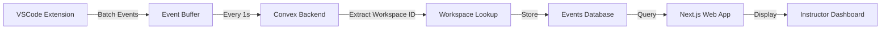

## Architecture Overview

Leopard is built on a modern, distributed architecture that captures student coding activity in real-time and provides powerful analysis tools for instructors.

### System Components

Leopard consists of three main components that work together:

<CardGroup cols={3}>
  <Card title="VSCode Extension" icon="code">
    Captures workspace events and coding activity in real-time from student development environments
  </Card>
  <Card title="Convex Backend" icon="database">
    Stores and processes events with automatic scaling and real-time synchronization
  </Card>
  <Card title="Next.js Web App" icon="browser">
    Provides instructor dashboards, submission management, and analysis tools
  </Card>
</CardGroup>

## Event Tracking Flow

<Steps>
  <Step title="Student Codes in VSCode">
    The Leopard VSCode extension monitors the student's workspace for code changes, file operations, and other development activities.
  </Step>
  
  <Step title="Events are Batched">
    Events are collected in a local buffer and batched together to minimize network overhead. By default, events are sent every 1000ms (1 second) after the last change.
  </Step>
  
  <Step title="Secure Transmission">
    Batched events are transmitted securely to the Convex backend via HTTPS using the `addBatchedChangesMutation` endpoint.
  </Step>
  
  <Step title="Workspace Identification">
    The backend extracts the workspace ID from the hostname (format: `coder-<workspaceId>-<pod-id>`) and associates events with the correct student workspace.
  </Step>
  
  <Step title="Event Storage">
    Events are stored in the Convex database with timestamps, allowing instructors to reconstruct the entire coding timeline.
  </Step>
  
  <Step title="Real-time Access">
    Instructors can view student progress, analyze submission histories, and detect potential integrity issues through the web dashboard.
  </Step>
</Steps>

## Workspace History Capture

### What Gets Tracked

Leopard captures detailed information about student coding activity:

- **Text Document Changes**: Every code edit, including the exact range modified, the text inserted/deleted, and the file path
- **Timestamps**: Precise timing for every event (millisecond precision)
- **File Context**: Complete file paths to understand which files students are working on

### Event Storage Schema

Events are stored in the Convex database using the following schema:

```typescript
events: {
  eventType: string,        // e.g., "DID_CHANGE_TEXT_DOCUMENT"
  timestamp: number,        // Unix timestamp in milliseconds
  workspaceId: Id<"workspaces">,
  metadata: Record<string, any>  // Event-specific data
}
```

Events are indexed by `workspaceId` and `timestamp` for efficient querying and timeline reconstruction.

## Data Flow Diagram



## Workspace Identification

Each student workspace is uniquely identified by a **Coder workspace ID** (UUID format). The VSCode extension automatically:

1. Reads the hostname from the development environment
2. Extracts the workspace UUID (e.g., `273044a0-03a7-49ef-b1a4-e1bbc3c49d9b`)
3. Includes it with every batch of events

The backend validates the UUID format and looks up the corresponding workspace record:

```typescript
// Hostname format: coder-273044a0-03a7-49ef-b1a4-e1bbc3c49d9b-7b78cdf4d9-mx66l
const coderWorkspaceId = hostnameParts.slice(1, 6).join("-");
const workspace = await ctx.db
  .query("workspaces")
  .withIndex("coderWorkspaceId", (q) => q.eq("coderWorkspaceId", coderWorkspaceId))
  .first();
```

## Event Recovery & Reliability

<Warning>
  **Current Limitation**: The extension does not yet implement automatic retry logic for failed event transmissions. If the connection to Convex is lost, events in the current batch may be lost.
  
  This is tracked in the codebase with TODO comments and will be addressed in a future release.
</Warning>

When events fail to send:
- Failed events are prepended back to the buffer for the next attempt
- A warning message is displayed in the VSCode output channel
- Users are notified with a VSCode notification

## Performance & Scalability

### Batching Strategy

Events are batched using a debounce mechanism:
- **Debounce delay**: 1000ms (configurable)
- **Buffer**: Accumulates events until the delay elapses
- **Transmission**: All buffered events sent in a single mutation

This approach minimizes:
- Network requests
- Backend load
- Database write operations

### Convex Backend Benefits

<AccordionGroup>
  <Accordion title="Automatic Scaling">
    Convex automatically scales to handle varying loads across multiple classrooms and assignments.
  </Accordion>
  
  <Accordion title="Real-time Sync">
    Changes are immediately available to all connected clients without manual polling.
  </Accordion>
  
  <Accordion title="Type Safety">
    Full TypeScript support ensures data integrity across the entire stack.
  </Accordion>
  
  <Accordion title="Optimized Indexing">
    Built-in indexes on `workspaceId` and `timestamp` enable fast timeline queries.
  </Accordion>
</AccordionGroup>

## Related Topics

<CardGroup cols={2}>
  <Card title="Event Tracking" icon="activity" href="/concepts/event-tracking">
    Learn about the specific event types and their schemas
  </Card>
  <Card title="Roles & Permissions" icon="shield" href="/concepts/roles-permissions">
    Understand who can access workspace data and submission history
  </Card>
</CardGroup>